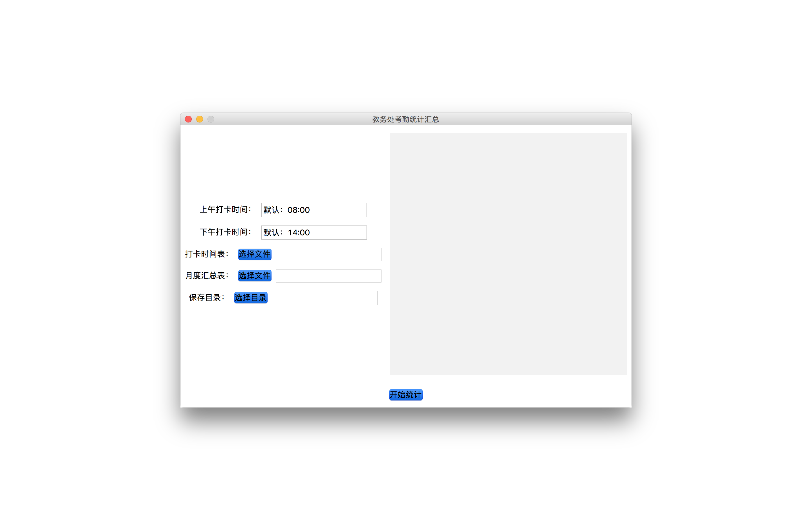

## 项目截图


## 安装依赖
tkinter
numpy
pandas
pyinstaller

```
pip install -r requirements.txt
```

## 运行
```
python main.py
```


## 编译为可执行文件
- Windows
   运行 build.bat 文件

- macOS 或者 Linux
   运行 build.sh 文件
